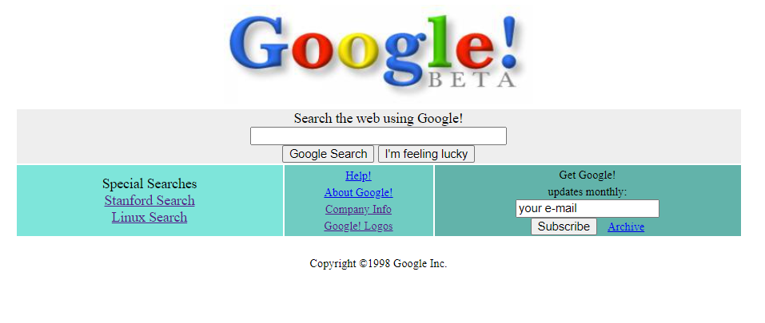

# Google Beta
## HTML ile Google Beta projesi

<p align="center">
  
</p>
## Installation

Öncelikle projeyi clonelayın.

```bash
git clone https://github.com/hibadem/google-beta.git
```

## Usage

Projeyi cloneladıktan sonra açınız.

```linux
cd google-beta/
```

Projeyi çalıştırın

```linux
code .
```
